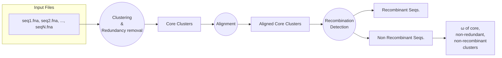

# CorEvol

CorEvol is a lightweight Python pipeline to calculate ω (dN/dS) values for the core genome of multiple genomic CDS sequences. The general workflow is described in the flowchart below.

## Table of Contents
- [General Info](#general-info)
- [Installation](#installation)
- [Usage](#usage)
- [License](#license)

## General Info
CorEvol processes a folder of your genomic CDS files and outputs the ω (dN/dS) values of the core, non-redundant, non-recombinant sequences, along with other useful files and folders. See [Usage](#usage) for more details.




## Installation
### Dummy installation
1. Create a conda environment.
```
conda create -n corevol_env python=3.8
conda activate corevol_env
```
2. Install OpenRDP in the said environment.
```
conda install -c bioconda openrdp
```
3. Clone the CorEvol repository.
```
git clone https://github.com/AbhishakeL/CorEvol.git
cd corevol
```
5. Install required Python packages.
```
pip install -r requirements.txt
```
## Usage
To use CorEvol, run the following command to get to know of all the available parameters and options:
```
python CorEvol.py -h
```
Usage options:
```
python CorEvol.py -h
usage: CorEvol.py [-h] -i DIRECTORY -o OUTPUT [-p PATH] [-c IDENTITY]
                  [-d LENGTH_DIFF] [-sc LENGTH_CUTOFF] [-aL ALIGN_COV_LONG]
                  [-aS ALIGN_COV_SHORT] [-g MEMORY] [-n WORD_LENGTH]
                  [-pC PHYLOGENY_CUTOFF] [-r RDP_CONFIG] [-x COUNTS]
                  [-t THREADS]

Pipeline for running CorEvol.

options:
  -h, --help            show this help message and exit
  -i DIRECTORY, --directory DIRECTORY
                        Directory containing the FASTA files
  -o OUTPUT, --output OUTPUT
                        Directory containing the output files
  -p PATH, --path PATH  Path where the cdhit program is located
  -c IDENTITY, --identity IDENTITY
                        Sequence identity threshold (default: 0.9)
  -d LENGTH_DIFF, --length_diff LENGTH_DIFF
                        Length difference cutoff (default: 0)
  -sc LENGTH_CUTOFF, --length_cutoff LENGTH_CUTOFF
                        Length difference cutoff in amino acid (default: 1)
  -aL ALIGN_COV_LONG, --align_cov_long ALIGN_COV_LONG
                        Alignment coverage for longer sequence (default: 0.9)
  -aS ALIGN_COV_SHORT, --align_cov_short ALIGN_COV_SHORT
                        Alignment coverage for shorter sequence (default: 0.9)
  -g MEMORY, --memory MEMORY
                        Maximum available memory in GB (default: 1)
  -n WORD_LENGTH, --word_length WORD_LENGTH
                        Word length (default: 3)
  -pC PHYLOGENY_CUTOFF, --phylogeny_cutoff PHYLOGENY_CUTOFF
                        Minimum length of nucleotides prior to alignment
                        (default : 500)
  -r RDP_CONFIG, --rdp_config RDP_CONFIG
                        Path where internal parameters of RDP scanner is saved
  -x COUNTS, --counts COUNTS
                        Number of different RDP testing methodology used to
                        confidently conclude a sequence to be recombinant
                        (default: 4, max: 6)
  -t THREADS, --threads THREADS
                        Number of threads (default: 4)
```
## License
This project is licensed under the GNU GPLv3 License. See the LICENSE file for details.
```
This README file includes more detailed instructions for installation and usage, and it ensures that the content is well-organized and easy to follow.
```
